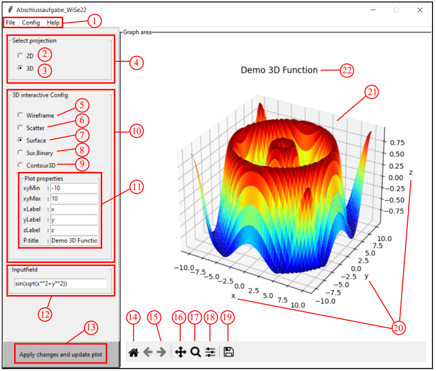
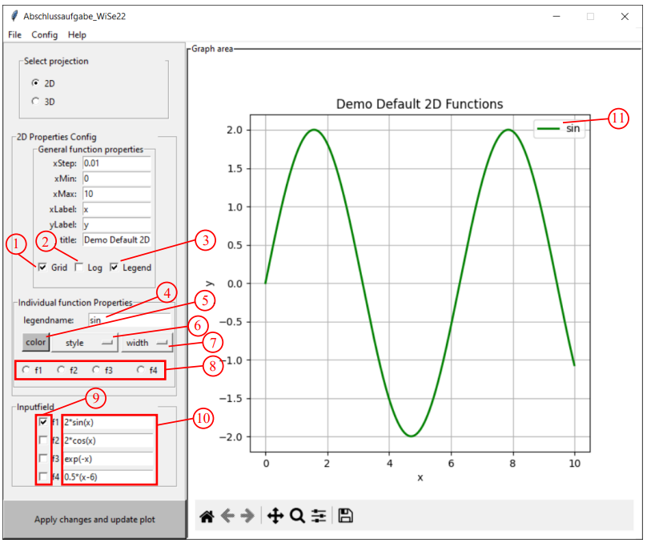

# plotter project using python
## [video demo](https://clipchamp.com/watch/h4oK67g4CN0)

## requirements
1. make sure python is installed in your local machine.
   <br> run following command ```py --version``` in your terminal
   <br> output should be ```Python 3.9.0 ``` somthing like that. 
  
2. [optional] if you want to clone my Repo using ```git```, you need to install it on your locale maschine [how to install git?](https://www.geeksforgeeks.org/how-to-install-git-on-windows-command-line/)<br> 
  <br> run ```git --version``` in your terminal after installing ```git```
  <br> output will look something like this ```git version 2.38.1.windows.1```


## Getting started (Installation)
1. create a new folder in your local machine  
2. open Terminal or shell navigate to your new folder
3. you can download & unzip project or clone it to your local machine. copy & past the following command in your ternimal ```git clone <clicke on Code Button, copy HTTPS URL & paste it here>``` 
4. after downloadig is finished, there will be a new folder called ```plotter-project-python``` where you can see the sourcecode ```src_plotProject``` and other files/folders
5. sofar so good:-) back to the terminal and change your path ```cd plotter-project-python``` your terminal path should look like this: ``` ..../<new folder>/plotter-project-python>```
6. now we need to install all dependencies and create the virtual environment. [virtual environment?](https://docs.python.org/3/library/venv.html) 
7. create a new virtual environment ```py -m venv plotProject_venv``` after running this command in terminal , a new folder ```plotProject_venv``` is created in ```plotter-project-python```folder
8. in order to install dependencies in our frish created ```plotProject_venv``` folder. we need to activate our virtual environment.
9. activate virtual environment in Windows ```plotProject_venv\Scripts\activate``` in MAC or Linux ``` source plotProject_venv\bin\activate ```
10. now your terminal should look like this ``` (plotProject_venv) C:\....\<new folder>\plotter-project-python> ```parentheses indicate the activation of our virtual environment
11. install all dependencies ```py -m pip install -r requirements.txt ```, 
    -> if there is issue with mathplotlib library so install it manually ```python -m pip install matplotlib```

## run programm and playaround
12. to start programm just write ```py src_plotProject/test.py ``` make sure you done step [10] ,[11] & your in right directory [5] in your terminal.


## Description
This project demonstrates how to develop your own plotter GUI in python which can plott 2D and 3D matimatical functions.
The program provides a user-friendly interface for inputting functions and generates visually appealing plots using libraries like Matplotlib and Numpy. 
Users can customize the plots, compare multiple functions, and export the plots in various formats. The project incorporates error handling to handle invalid inputs and aims to facilitate the visualization and analysis of mathematical function.

### 3D-function demo 
##### ( take a look to the demo folder for more examples)

### 2D-function demo
##### ( take a look to the demo folder for more examples) 
  


## Support
for technical support or undrestandig of the programm you can send me an Email @"jalilrasooly2010@gmail.com"

## Authors
Jalil Rasooly

## License
MIT

## Project status
I am not working at this project anymore due to the lack of time but maybe in future :-)

